# XenoCRM: Comprehensive Developer Documentation 🚀

XenoCRM is a cutting-edge, AI-powered Customer Relationship Management (CRM) platform built to automate segment creation, campaign drafting, outcome prediction, and omnichannel message dispatching. It utilizes a microservices architecture, real-time analytics, and dual-LLM integration for an unparalleled user experience.

This documentation covers every detail of the application, from the database schema and background services to the AI agent integrations and complete API layer.

---

## 🏗️ 1. Architecture & Tech Stack

The project is structured as a Turborepo monorepo with three interconnected applications.

### 🗺️ System Architecture Diagram

```mermaid
graph TD
    classDef frontend fill:#3b82f6,stroke:#1e3a8a,stroke-width:2px,color:#fff;
    classDef backend fill:#10b981,stroke:#065f46,stroke-width:2px,color:#fff;
    classDef db fill:#f59e0b,stroke:#b45309,stroke-width:2px,color:#fff;
    classDef ai fill:#8b5cf6,stroke:#4c1d95,stroke-width:2px,color:#fff;
    classDef service fill:#f43f5e,stroke:#9f1239,stroke-width:2px,color:#fff;

    subgraph ClientLayer
        Router[React Router DOM]
        State[Local React State]
        UI[Glassmorphic UI]
        Charts[Recharts Visualizations]
        
        Router --> UI
        State --> UI
        UI --> Charts
    end
    class Router,State,UI,Charts frontend;

    subgraph APILayer
        AuthMiddleware[Clerk Auth Middleware]
        Routers[Express Routers]
        Mutex[PQueue Mutex]
        Dispatcher[Campaign Dispatcher]
        
        AuthMiddleware --> Routers
        Routers --> Mutex
        Routers --> Dispatcher
    end
    class AuthMiddleware,Routers,Mutex,Dispatcher backend;

    subgraph DatabaseLayer
        Customers[(Customers and Segments)]
        Campaigns[(Campaigns and Comms)]
        Stats[(CampaignStats and SegmentStats)]
        Orders[(Orders and Revenue)]
        
        Customers <.-.> Campaigns
        Campaigns <.-.> Stats
        Customers <.-.> Orders
    end
    class Customers,Campaigns,Stats,Orders db;

    subgraph MicroservicesLayer
        ChannelSim[Channel Simulator]
        SimLogic[Funnel Simulator]
        Gemini[Google Gemini Engine]
        Groq[Groq Llama Engine]
        
        ChannelSim --> SimLogic
    end
    class ChannelSim,SimLogic service;
    class Gemini,Groq ai;

    UI -- REST API --> AuthMiddleware
    
    Routers -- Atomic Math --> Stats
    Routers -- SQL Queries --> Customers
    Routers -- Batch Inserts --> Campaigns
    Mutex -- Atomic Safety --> Stats
    
    Dispatcher -- Webhooks --> ChannelSim
    SimLogic -- Callbacks --> Mutex
    
    Routers -- Function Calling --> Gemini
    Routers -- Context Polling --> Groq
```

### 🧠 XenoAI Agent Execution Flow

```mermaid
sequenceDiagram
    participant User as React Frontend
    participant API as Express API (/api/agent/chat)
    participant Gemini as Google Gemini 1.5 Pro
    participant DB as Supabase PostgreSQL

    User->>API: POST /chat (User Prompt: "Draft VIP Campaign")
    
    rect rgb(20, 30, 40)
        Note over API,Gemini: AI Orchestration Phase
        API->>Gemini: Inject System Prompt + History
        API->>Gemini: Send User Prompt
        Gemini-->>API: Tool Request: getSegments()
        API->>DB: SELECT * FROM Segment LIMIT 10
        DB-->>API: Array of Segments
        API->>Gemini: Tool Response (JSON)
        
        Gemini-->>API: Tool Request: createDraftCampaign()
        API->>DB: INSERT INTO Campaign (status: 'draft')
        DB-->>API: Return Campaign ID & Target Count
        API->>Gemini: Tool Response (JSON)
    end
    
    Gemini-->>API: Final Structured Output (JSON Object)
    
    rect rgb(20, 40, 30)
        Note over API,User: Frontend Rendering Pipeline
        API-->>User: Return { lastStructured: { type: 'draft', data: {...} } }
        User->>User: Parse JSON Payload
        User->>User: Map type 'draft' to <PredictionPanel />
        User->>User: Render Recharts Gauge & Dispatch Buttons
    end
```



### 1.1 Frontend (`apps/frontend`)
The user-facing web application.
- **Framework:** React + Vite + TypeScript
- **Styling:** Tailwind CSS + Lucide React Icons
- **Data Visualization:** Recharts for dynamic, interactive KPI graphs and prediction analytics.
- **Routing & State:** React Router DOM, Axios for API communication.
- **Design System:** Custom glassmorphic UI with a premium dark/light "XenoAI" agent command center interface.

### 1.2 Backend (`apps/backend`)
The core API server that handles business logic, database operations, and primary AI orchestration.
- **Runtime:** Node.js + Express + TypeScript
- **Database:** Supabase (PostgreSQL) + `@supabase/supabase-js` client for database operations.
- **Caching:** ETag generation (HTTP 304 Not Modified) for hyper-fast UI polling.
- **AI Integration (Primary):** Google GenAI (Gemini) powers the core `XenoAI` agent for executing complex tasks via function calling.
- **AI Integration (Secondary):** Groq API (`llama-3.1-8b-instant`) powers the ultra-fast, context-aware "Dynamic Recommendations" engine.
- **Authentication:** Clerk middleware protects all sensitive API endpoints.

### 1.3 Channel Service (`apps/channel-service`)
An independent microservice simulating an omnichannel dispatching system.
- **Role:** Handles the actual execution of sending messages via simulated Email, SMS, WhatsApp, and RCS protocols.
- **Tracking:** Generates and returns realistic delivery, open, click, and conversion events via webhook back to the main backend.
- **Delay Simulation:** Imitates real-world network latency and asynchronous email delivery pipelines.

---

## 🗄️ 2. Database Schema

The application relies on a strictly relational PostgreSQL database hosted on Supabase, designed for massive analytical queries and atomic transaction tracking. The schema is interacted with via the Supabase Data API.

### Core Models:

1. **`Customer`**: The base entity.
   - Fields: `id`, `name`, `email`, `phone`, `city`, `gender`, `birthday`
   - Aggregates: `totalSpend`, `orderCount`, `lastOrderDate`, `membershipTier`
   - Indexes on city, totalSpend, and lastOrderDate for ultra-fast segment filtering.

2. **`Order`**: Tracks individual purchases.
   - Fields: `id`, `amount`, `items` (JSON).
   - Relations: Belongs to `Customer`. Has an optional `communicationId` for strict revenue attribution (ROI tracking).

3. **`Segment`**: Dynamic audience groups.
   - Fields: `name`, `filterConfig` (JSON array of rules), `customerCount`.
   - The user or AI saves a filter (e.g., "Spend > 10000"), and the system counts matches.

4. **`Campaign`**: An outgoing marketing push.
   - Fields: `name`, `channel` (email, sms, whatsapp, rcs), `messageTemplate`, `status` (draft, sending, sent).
   - Relations: Targets one `Segment`.

5. **`Communication`**: The most critical model. Tracks individual messages per customer per campaign.
   - Fields: `status` (queued → sent → delivered → opened → clicked → converted).
   - Timestamps: `queuedAt`, `sentAt`, `deliveredAt`, `openedAt`, `clickedAt`, `convertedAt`.
   - This allows granular funnel tracking for every single message sent.

6. **`CampaignStats` & `SegmentStats`**:
   - Denormalized tables updated atomically when a communication changes status. Used to quickly serve the dashboard without running expensive `COUNT(*)` queries on millions of communications.

---

## 🤖 3. The XenoAI Agent Ecosystem

The crown jewel of XenoCRM is the **Agent Page**, an interactive command-center where users converse with the CRM. We use a **Dual-AI Architecture**.

### 3.1 The Action Engine (Google Gemini 1.5)
When a user types a prompt (e.g., *"Draft an email campaign for my Gold Members"*), Gemini processes it. We utilize **Function Calling (Tools)** to allow Gemini to execute backend code.

Available Tools:
- `getSegments`: Fetches existing segments to find the right audience.
- `createSegment`: Builds a new JSON filter based on natural language constraints.
- `predictCampaignOutcome`: Reads historical `SegmentStats` and `CampaignStats` to predict Open Rates, Conversions, Revenue, and Risk Level for a proposed campaign.
- `createDraftCampaign`: Automatically writes promotional copy, creates a database draft, and calculates audience size.
- `revenueReport` & `compareCampaigns`: Analytical tools for deep reporting.

### 3.2 The Recommendation Engine (Groq Llama 3.1)
Instead of static UI buttons, the frontend polls `/api/agent/recommendations` every 5 minutes. 
The backend fetches the 5 most recent campaigns and segments, crafts a context prompt, and sends it to Groq. Groq (being incredibly fast) returns 8 JSON objects containing highly contextual "Action Chips" (e.g., *"Predict outcome for Diwali SMS"*). The frontend maps these to Lucide icons and renders them.

### 3.3 Structured UI Responses
When Gemini drafts a campaign, the backend doesn't just return markdown text. It returns `lastStructured: { type: 'draft', data: {...} }`. The frontend React app intercepts this and renders a beautiful, interactive **Prediction Panel** with Recharts progress bars and one-click dispatch buttons.

---

## ⚙️ 4. Background Services & Event Driven Logic

### The Dispatcher (`apps/backend/src/services/dispatcher.ts`)
Sending 10,000 emails cannot happen synchronously. XenoCRM implements a background queue:
1. When a campaign is set to `sending`, the dispatcher creates `Communication` records with `status = 'queued'`.
2. A background loop picks up batches of 50 queued communications.
3. It POSTs them to the `Channel Service`.
4. The Channel Service accepts them and responds `200 OK`. The backend marks them as `sent`.

### Webhook Receipts (`apps/backend/src/routes/receipts.ts`)
The Channel Service asynchronously simulates user behavior (delays, opens, clicks, conversions).
It fires POST requests back to the backend's `/api/receipts/webhook`.
The backend processes the webhook, updates the exact `Communication` timestamp, and atomically increments the `CampaignStats`. If the event is a `conversion`, an `Order` is automatically generated and attributed to the campaign!

---

## 🌐 5. Comprehensive API Endpoints

The backend is built with Express Router. All routes except `/api/receipts/webhook` require a valid Clerk Authentication token in the `Authorization: Bearer <token>` header.

### 🤖 Agent API (`/api/agent`)

**`POST /chat`**  
The core Gemini conversation endpoint.
- **Request:** `{ "prompt": "Draft an email", "history": [{ "role": "user", "content": "..." }] }`
- **Response:** `{ "reply": "...", "actions": [...], "structured": { "type": "draft", "data": {...} } }`

**`GET /recommendations`**  
Fetches contextual Groq-powered action chips.
- **Response:** `{ "recommendations": [{ "prompt": "...", "type": "...", "context": "..." }] }`

---

### 📊 Dashboard API (`/api/dashboard`)

**`GET /stats`**  
Returns high-level application metrics. Supports ETag caching.
- **Response:** 
```json
{
  "totalRevenue": 1500000,
  "activeCampaigns": 12,
  "totalCustomers": 5430,
  "roi": "+24%"
}
```

---

### 📢 Campaigns API (`/api/campaigns`)

**`GET /`**  
List all campaigns.
- **Response:** `[{ "id": "...", "name": "...", "status": "sent", "channel": "email" }]`

**`POST /`**  
Create a new draft campaign.
- **Request:** `{ "name": "...", "channel": "...", "messageTemplate": "...", "segmentId": "..." }`
- **Response:** `{ "id": "...", "status": "draft" }`

**`GET /:id`**  
Get specific campaign details including stats.
- **Response:** `{ "campaign": {...}, "stats": { "sent": 100, "opened": 50, "revenue": 5000 } }`

**`POST /:id/dispatch`**  
Triggers the background dispatcher for a draft campaign.
- **Response:** `{ "message": "Dispatch started", "queuedCount": 1000 }`

**`DELETE /:id`**  
Deletes a campaign and its queued communications.

---

### 🎯 Segments (Audiences) API (`/api/audiences`)

**`GET /`**  
List all segments.
- **Response:** `[{ "id": "...", "name": "...", "customerCount": 5000 }]`

**`POST /`**  
Create a new segment.
- **Request:** `{ "name": "...", "filterConfig": [{ "field": "totalSpend", "operator": "gt", "value": 1000 }] }`
- **Response:** `{ "id": "...", "customerCount": 450 }`

**`POST /preview`**  
Preview segment size without saving.
- **Request:** `{ "filterConfig": [...] }`
- **Response:** `{ "count": 450 }`

**`GET /:id`**  
Get segment details and associated customers.

---

### 👥 Customers API (`/api/customers`)

**`GET /`**  
Paginated list of customers.
- **Query Params:** `?page=1&limit=50&search=john`
- **Response:** `{ "data": [{ "name": "John", ... }], "total": 1000 }`

**`GET /:id`**  
Full customer profile.
- **Response:** `{ "profile": {...}, "orders": [...], "communications": [...] }`

---

### 📈 Analytics API (`/api/analytics`)

**`GET /campaign-performance`**  
Time-series data for charting.
- **Response:** `[{ "date": "2023-10-01", "revenue": 5000, "opens": 150 }]`

**`GET /revenue-attribution`**  
Breakdown of revenue by channel.
- **Response:** `[{ "channel": "email", "revenue": 100000 }, { "channel": "whatsapp", "revenue": 50000 }]`

---

### 🛒 Orders API (`/api/orders`)

**`GET /`**  
List of recent orders.
- **Response:** `[{ "id": "...", "amount": 150, "customerId": "..." }]`

**`POST /`**  
Manually create an order.
- **Request:** `{ "customerId": "...", "amount": 150, "items": [...] }`

---

### 📡 Communications & Webhooks

**`GET /api/communications`**  
Live feed of outgoing messages.
- **Response:** `[{ "id": "...", "status": "delivered", "customerName": "..." }]`

**`POST /api/receipts/webhook`**  
**Public endpoint.** Receives simulated events from the Channel Service.
- **Request:** `{ "communicationId": "...", "event": "opened", "timestamp": "..." }`
- **Response:** `200 OK`

---

## 🚀 6. Getting Started & Setup

### Prerequisites
- Node.js (v18+)
- PostgreSQL Database (Supabase recommended)
- Google Gemini API Key
- Groq API Key
- Clerk Publishable & Secret Keys

### Installation & Execution

1. **Install dependencies** at the monorepo root:
   ```bash
   npm install
   ```

2. **Environment Variables**:
   Create `.env` files in the respective apps.
   **Backend (`apps/backend/.env`)**:
   ```env
   DATABASE_URL="postgresql://..."
   DIRECT_URL="postgresql://..."
   GEMINI_API_KEY="..."
   GROQ_API_KEY="gsk_..."
   CLERK_SECRET_KEY="sk_test_..."
   ```
   **Frontend (`apps/frontend/.env`)**:
   ```env
   VITE_CLERK_PUBLISHABLE_KEY="pk_test_..."
   VITE_API_URL="http://localhost:3001"
   ```

3. **Database Migration**:
   If needed, push your schema to Supabase directly from the SQL editor or through your preferred migration tool, as we rely on the Supabase JS client for actual querying.

4. **Run the ecosystem concurrently**:
   Open three terminal tabs and start the services:
   ```bash
   # Terminal 1: Backend API
   cd apps/backend && npm run dev
   
   # Terminal 2: Channel Service (Simulator)
   cd apps/channel-service && npm run dev
   
   # Terminal 3: Frontend Web App
   cd apps/frontend && npm run dev
   ```

5. **Access the App**:
   Navigate to `http://localhost:3000` to see XenoCRM in action!
