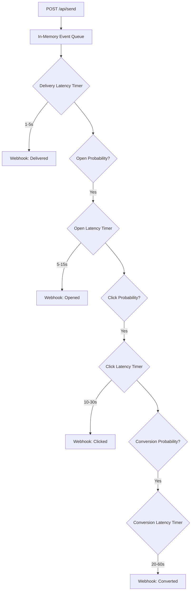

# XenoCRM Channel Service (Simulator)

The Channel Service is an independent Node.js/Express microservice. Its sole purpose is to simulate the asynchronous, chaotic, and delayed nature of real-world communication providers (like SendGrid for Email, Twilio for SMS, Meta for WhatsApp, or Google for RCS).

---

## 🎯 The Problem it Solves

In a real production CRM, when you dispatch a campaign to 10,000 users, the following happens:
1. The provider accepts the payload immediately.
2. It takes minutes/hours to actually deliver the messages to handsets/inboxes.
3. Users open the messages hours later (or never).
4. Users click links minutes after opening.
5. Users purchase items (convert) minutes/hours after clicking.

To demonstrate XenoCRM's powerful funnel tracking, analytics, and ROI attribution without actually sending real messages, the Channel Service perfectly imitates this lifecycle.

---

## 🏗️ Technical Architecture

- **Runtime:** Node.js + Express
- **Concurrency:** Relies heavily on Node's non-blocking Event Loop (`setTimeout`) to manage thousands of simultaneous simulated lifecycles without crashing.
- **Stateless:** The service does not have a database. It holds the simulation timers in memory and forgets about them once the final webhook is fired.

### 🗺️ Simulation Architecture



---

## ⚙️ The Simulation Lifecycle

When the main backend sends a payload to `POST /api/send`, the Channel Service responds with `200 OK` instantly, then begins the simulation cascade in the background.

### 1. Delivery Phase
Every message has a guaranteed delivery, but with varying latency.
- **Latency:** Random delay between `1,000ms` and `5,000ms`.
- **Action:** Fires a `delivered` webhook.

### 2. Open Phase
If the message was delivered, the system calculates a probability based on the channel type.
- **Math:** `Math.random() < CHANNEL_PROBABILITIES[channel].open`
- **Latency:** Random delay between `5,000ms` and `15,000ms`.
- **Action:** Fires an `opened` webhook.

### 3. Click Phase
If the message was opened, calculate click probability.
- **Math:** `Math.random() < CHANNEL_PROBABILITIES[channel].click`
- **Latency:** Random delay between `10,000ms` and `30,000ms`.
- **Action:** Fires a `clicked` webhook.

### 4. Conversion Phase
If the message was clicked, calculate conversion (purchase) probability.
- **Math:** `Math.random() < CHANNEL_PROBABILITIES[channel].conversion`
- **Latency:** Random delay between `20,000ms` and `60,000ms`.
- **Action:** Fires a `converted` webhook.

---

## 📊 Channel Probabilities

Different channels exhibit vastly different engagement metrics. The simulator uses hardcoded weights to reflect reality:

| Channel | Open Rate | Click Rate | Conversion Rate |
| :--- | :--- | :--- | :--- |
| **Email** | 30% | 15% | 5% |
| **SMS** | 95% | 20% | 8% |
| **WhatsApp**| 90% | 35% | 15% |
| **RCS** | 85% | 40% | 18% |

*Because of these weights, sending a WhatsApp campaign in XenoCRM will result in visibly higher ROI on the dashboard compared to an Email campaign!*

---

## 📡 Webhook Dispatching

When a timer triggers an event, the service constructs a payload:
```json
{
  "communicationId": "uuid-from-database",
  "event": "opened",
  "timestamp": "2023-10-01T12:00:00Z"
}
```
It then POSTs this directly to the main backend's public endpoint (`http://localhost:3001/api/receipts/webhook`). If the backend is down, the webhook silently fails (fire-and-forget).

---

## 🚀 Development Setup

1. Ensure the main backend is running on port 3001 (or update the webhook URL target in `src/index.ts`).
2. Run `npm install`
3. Run `npm run dev` to start the simulator on port 3002.
